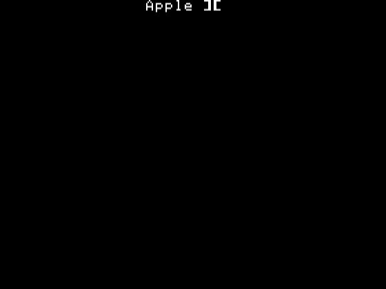
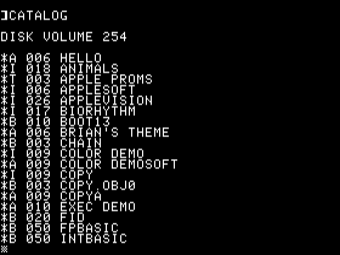
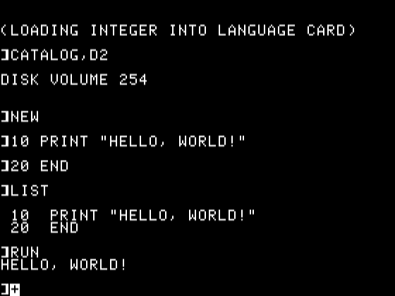
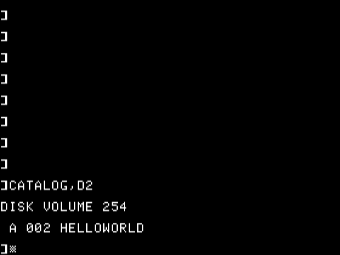

# Day 1

To start out, lets go back to my roots. The first programming language I did ever was Apple Basic on an Apple IIc. Lets see how good I can do recreating that environment

## PreReqs for Ubuntu 22.04
- MAME (from distro package manager) `sudo apt install mame`
- ROMs for Apple IIc and/or Apple IIe (user-exercise to find these)
- [DOS 3.3 Master .dsk image ](https://mirrors.apple2.org.za/ftp.apple.asimov.net/images/masters/DOS%203.3%20System%20Master%20-%20680-0051-00.dsk)
- [AppleCommander v1.10.1](https://github.com/AppleCommander/AppleCommander/releases/tag/1.10.1) for copying files in-out of .dsk images.

### Create disk to save your work

Run AppleCommander

```
java -jar AppleCommander-linux-x86_64-1.10.1.jar
```

Create a DOS 3.3 disk saved in the same place as your master DOS dsk. I named mine `aoc2025.dsk`

### Run Apple DOS 3.3 in MAME in apple2c mode

```
mame -rompath "$HOME/.mame/roms" apple2c -window -nomouse -flop1 DOS\ 3.3\ System\ Master\ -\ 680-0051-00.dsk -flop2 aoc2025.dsk -keepaspect -snapsize 560x420
```

 

#### Using DOS

List files on OS disk

```
]CATALOG,D1

DISK VOLUME 254

*A 006 HELLO
*I 018 ANIMALS
(many more files)...
```



You won't need to worry about most of these, but it's interesting to see.

List files on your data disk.

```
]CATALOG,D2

DISK VOLUME 254

```


This should show empty as no files are created yet.

#### Create and run a Hello World program.

```
]NEW
]10 PRINT "HELLO, WORLD!"
]20 END
]LIST
]RUN
]SAVE HELLOWORLD
```

 

### Export files from disk image

If you want to extract files you have saved into the disk image, again run AppleCommander

```
java -jar AppleCommander-linux-x86_64-1.10.1.jar
```

Open aoc2025.dsk, highlight HELLOWORLD. Click export and save the file as an AppleBasic file in your desired path.