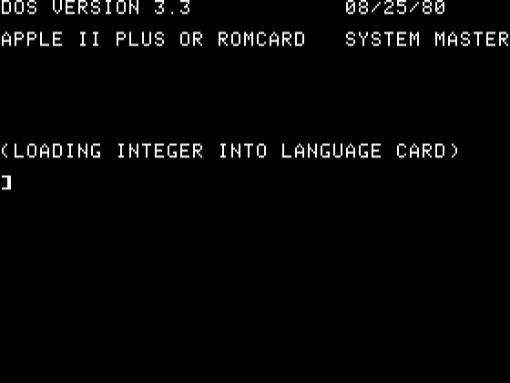
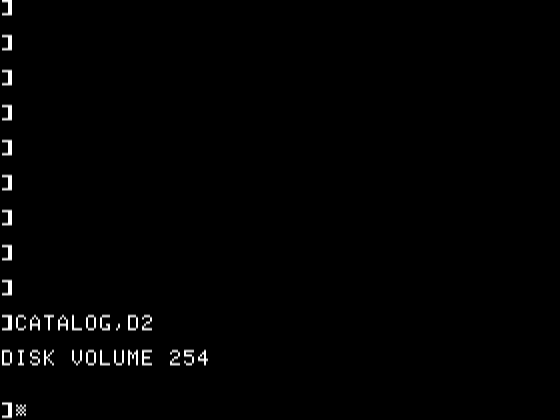

# Day 1

To start out, let’s go back to my roots. The first programming language I can remembered learning is Apple BASIC on an Apple IIc. Since I no longer have the Apple II, I had to scour the web for its ROMs and emulate it in MAME to get as close to the original experience as possible.

I initially started programming directly in Apple DOS 3.3, getting about halfway through, but then switched over to VSCode as my code became more complex. I still ran it inside the emulated Apple II to obtain the answers. For the very hard-core, I challenge you to try doing everything entirely in Apple DOS without using a modern editor at all.

## Prerequisites for Ubuntu 22.04

* MAME (from distro package manager): `sudo apt install mame`
* ROMs for Apple IIc and/or Apple IIe (user must obtain these)
* [DOS 3.3 System Master .dsk image](https://mirrors.apple2.org.za/ftp.apple.asimov.net/images/masters/DOS%203.3%20System%20Master%20-%20680-0051-00.dsk)
* [AppleCommander v1.10.1](https://github.com/AppleCommander/AppleCommander/releases/tag/1.10.1) for copying files in and out of `.dsk` images, or a newer version if you have a newer version of Java installed.

### Create a disk to save your work

Run AppleCommander:

```
java -jar AppleCommander-linux-x86_64-1.10.1.jar
```

To save your programs, create a DOS 3.3 disk saved in the same directory as your master DOS disk. I named mine `aoc2025.dsk`.

### Run Apple DOS 3.3 in MAME in Apple IIe mode

```
mame -rompath "$HOME/.mame/roms" apple2ee -window -nomouse \
-flop1 DOS\ 3.3\ System\ Master\ -\ 680-0051-00.dsk \
-flop2 aoc2025.dsk -keepaspect -snapsize 560x420
```

 

#### Using DOS

List files on the OS disk:

```
]CATALOG,D1

DISK VOLUME 254

 *A 006 HELLO
 *I 018 ANIMALS
(many more files)...
```


You will not need most of these, but it is fun to see what is there.

List files on your data disk:

```
]CATALOG,D2

DISK VOLUME 254
```



This should be empty because no files exist yet.

#### Create and run a Hello World program

```
]NEW
]10 PRINT "HELLO, WORLD!"
]20 END
]LIST
]RUN
]SAVE HELLOWORLD
```

 

### Export files from the disk image

If you want to extract files you saved into the disk image, run AppleCommander again:

```
java -jar AppleCommander-linux-x86_64-1.10.1.jar
```

Open `aoc2025.dsk`, highlight `HELLOWORLD`, click **Export**, and save it as an AppleBasic file to your preferred path.

## Now for the daily challenge

### Grab the input file

You may want to use the small “sample” input from the Day 1 explanation when testing. Once your program works, use your personal very large input file to get the final answer.

### Convert CRLF and LF to CR

You need to convert endlines to CR for Apple DOS to recognize the file as text. On Linux this is easy with `sed` and `tr`:

```
sed 's/\r$//' INPUT.TXT | tr '\n' '\r' > INPUT.TXT.CR
```

Next, load the input file into your data disk using AppleCommander. Import `INPUT.TXT.CR`, then rename it to `INPUT`. If the filetype is not `T` (text), something is wrong.

Once the disk is saved, boot MAME and list the contents of Disk 2:

```
]CATALOG,D2

DISK VOLUME 254

 A 002 HELLOWORLD
 T 002 INPUT
```

### Code your program

If you want to go hardcore and program inside DOS itself, feel free. I will add explanations for that later.

Alternatively, you can write your code externally in something like VSCode, then import it into the disk image the same way you did with the input file. Be sure to run it through the sed+tr conversion. When importing with AppleCommander, make sure the filetype is set to `A`. I used the destination filename `DAY1A`.

#### Test your program in MAME/Apple DOS:

Start it up again, then run.

```
] CATALOG,D2
] RUN DAY1A
```

If it worked, the answer for the sample input should be **3**.

### Replace the sample input with your real input

A working program using the small sample input should run in just a few seconds. Once it works, replace `INPUT` with your real input file. This may take a while to run at emulated 1 MHz, so feel free to fast-forward the emulation in MAME. Props to anyone who tries this on real hardware.

To see my final solution code, check out `DAY1A.bas` in this repo.
