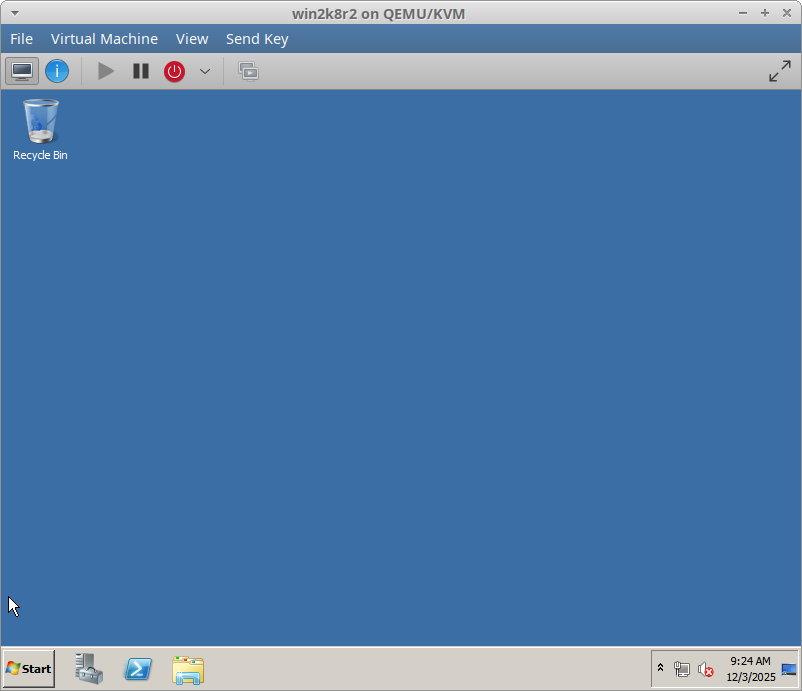
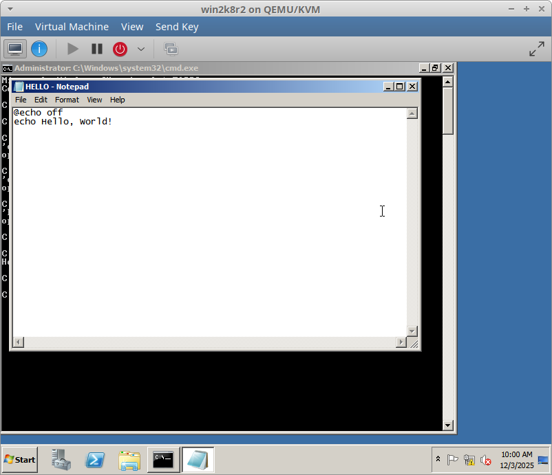
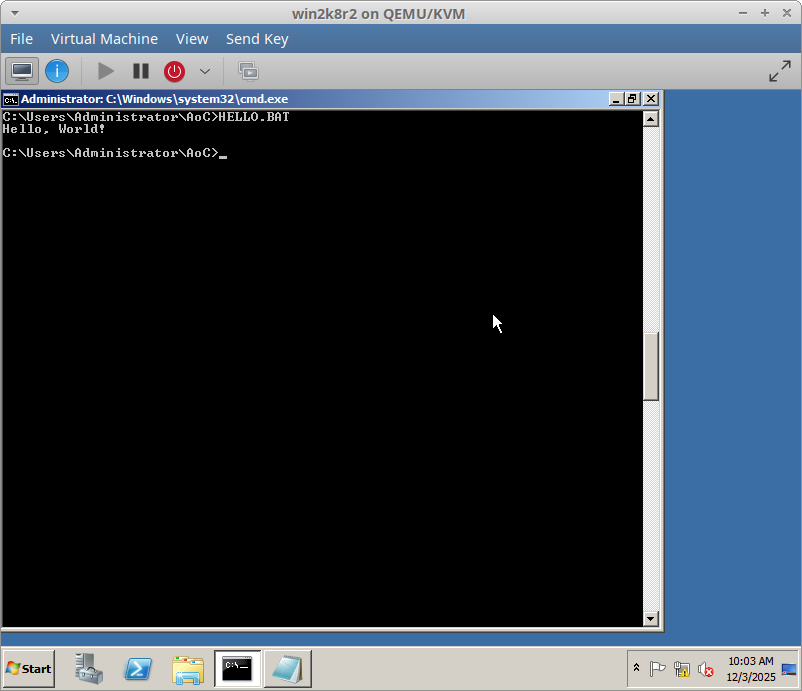
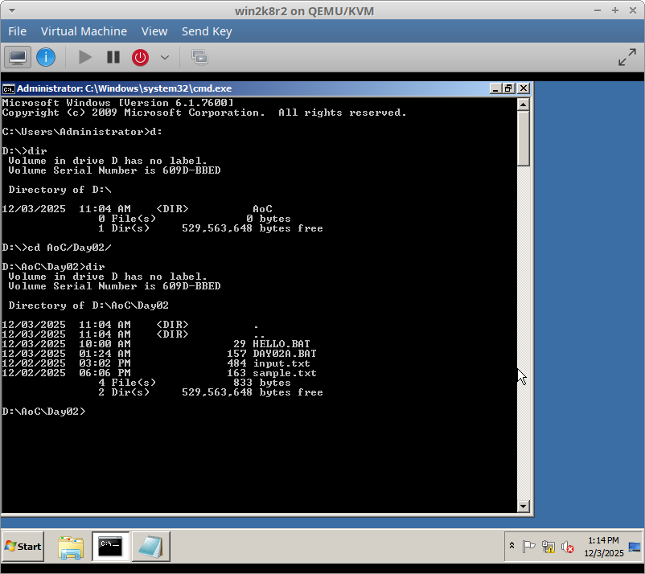

# Day 2

In the 1990s I spent a lot of time on Windows 3.1/MS-DOS, Windows 95, Windows 98, and later Windows ME. Being the clueless teenage "1337 HAX0R" I thought I was at the time, I dabbled in Batch scripting. I never accomplished much back then and I can't remember doing much more than looping a few commands in a .bat file or launching a program with special flags, but I at the time thought it was programming, and it does have some elements of a programming language, so I will attempt to use it for Day 2.

## Choosing your environment

There are a number of ways you could approach this day's challenge in Batch scripting. I will focus on MS-DOS and Win9x variants here, but you could use newer Windows NT (XP/7) versions of DOS/Batch and still be close enough.

1. **Pure**<br />
   The hardcore option is to use real MS-DOS or Windows. VMware or VirtualBox would also count as "pure enough" in my book, but extra points for bare-metal attempts.

2. **Free**<br />
   Another option, less pure but more open and non-proprietary, is FreeDOS, which also works on real hardware or in a VM.

3. **Easy**<br />
   Less pure still, but close enough, are tools like DOSBox and DOSBox-X. These lean more toward emulation, but offer many conveniences compared to native options. Still close enough for AoC.

4. **Dirty**<br />
   Probably the easiest and laziest option would be running DOS programs under WINE, but it works good enough for AoC challenges.

Although I do not have easy access to true Windows on my personal machines anymore, I could use an old Windows ISO with VirtualBox. However, I am going to try one of the DOS-Box options first, with DOS-Box-X.

<details>
  <summary><strong>Spoilers about my initial choice if you are following along</strong></summary>
  My initial choice for programming language/environemnt turned out to not work out and I had to adapt a bit to using Windows Server 2008 in a VM. <a href="#immediate-roadblock">Skip down</a> if you are following along and don't want to set up DOSBox-X which will not be used.
</details>

## Prerequisites for Ubuntu 22.04

In my Ubuntu 22.04 install, DOSBox is available in the apt repo, and DOSBox-X is available as a snap.

```
sudo snap install dosbox-x
```

or

```
sudo apt install dosbox
```

I went with DOSBox-X. Once installed, launch it:

```
dosbox-x
```


## A simple Hello World

Once inside DOSBox-X, mount a directory. I chose to mount /home/jon/code/AdventOfCode/2025/Day02/ as my A: drive.

```
mount a /home/jon/code/AdventOfCode/2025/Day02/
a:
dir
```

You should now see the contents of the mounted directory.


Next, create the `HELLO.BAT` file. Back in the day I used Notepad in Windows, but for the challenge I will use the DOS text editor `edit`. Sadly it's not white-on-blue like the original, but it works pretty much the same.

```
edit HELLO.BAT
```


Type the basic Hello World program below:

```
@echo off
echo Hello World
```


Save with Ctrl-S, then exit with Alt-X, or use the menus.

Check the directory listing for the new program:

```
dir
```


Then run the program:

```
HELLO.BAT
```


## The daily challenge

### 🧱 Immediate Roadblock

In researching Batch I quickly found that the COMMAND.COM in MS-DOS 6 and Win9x for Batch programming is not up to the task of this AoC challenge. This is primarily because several limitations:

- Can't read files line-by-line or in it's entirety into a variable
- Almost no string manipulation
- Limited looping

With COMMAND.COM much of the advanced processing is usually done with other helper programs in other languages with Batch just being used as a simple launcher. At that point I am basically using a different programming language for the challenge so whats the point of trying to use Batch?

### ❓ So what now?

How can I pull this off and be as pure as possible. Some options:

#### 4DOS
DOSBox can run 4DOS, which is much more capable. It originates from 1989 and was intended as a replacement for COMMAND.COM in MS-DOS, and Windows 9x. However, not a Microsoft product.

#### NT cmd.exe
Step slightly into the future and use cmd.exe from NT-based Windows (NT, 2000, XP, 7, etc). Would need VirtualBox, libvirt, or another VM. Sourced from Microsoft and native to Windows, but the timeframe and versions don't match what I learned, if I am trying to stay true to my original intent for these challenges.

#### Manually set variables to match the input data
The input file is shorter today, so this MIGHT be possible depending on how capable the string manipulation and looping is in DOS 6 Batch. I'll have to investigate this further before eliminating it as an option.

So which do I use? I will sleep on it and return to this later...

### The next day...

I am going to fudge my rules a bit and try to use cmd.exe from Windows XP or newer. If that doesn't work out I will fall-back to 4DOS

#### Where to get it?

I thought I had an old XP ISO in my backups from back in the day, but I can't find it. I may still have a CD in the file cabinet. ChatGPT's suggests getting the Windows XP Mode VHD intended for use in Windows 7, but any download links I can find from legitimate sources are long dead. I did find a still-live download for Server 2008, which is in the same family as XP, in VHD format for evaluation [here](https://www.microsoft.com/en-us/download/details.aspx?id=2227). Evaluation is more than enough for a one day challenge. You will need the part 1 .exe and the part 2 and part 3 .rar files. With all three files in your CWD, extract with `unrar x <file>`.

```
sudo apt install unrar
unrar x WS2008R2Fullx64Ent.part01.exe
```

The 6.5GB VHD file needed will extract to `./WS2008R2Fullx64Ent/WS2008R2Fullx64Ent/Virtual Hard Disks/WS2008R2Fullx64Ent.vhd`

If you will be using libvirt, you can use this directly, so skip down below. If you have VirtualBox, follow the next section.

#### Option 1: VirtualBox

Make sure VirtualBox is installed from your package manager or another method, then run:

```
VBoxManage clonehd "./WS2008R2Fullx64Ent/WS2008R2Fullx64Ent/Virtual Hard Disks/WS2008R2Fullx64Ent.vhd" "WS2008R2Fullx64Ent.vdi" --format VDI
```

You will then have a .vdi file you can move elsewhere to use in VirtualBox.

#### Option 2: libvirt

Move the .vhd to your desired location. I used VirtMachineManager to import the vhd as a disk image, did basic VM config steps (no need for a NIC), then started the VM, answered some setup questions, set a password, etc. A few minutes later I had a Desktop.

I suggest turning off a lot of stuff you don't need.

Services:
DHCP Client (unless you want network)
DNS Client (unless you want network)
Print Spooler
Server
TCP/IP NetBIOS Helper
Windows Remote Management
Windows Update



Run Start -> Run -> `cmd.exe`

This version of windows does not have `edit` for command-line text editing, so I'll use `notepad`, which honestly is what I used back in the day anyway.

```
notepad HELLO.BAT
```

Type in the same hello world program.

```
@echo off
echo Hello, World!
```



Save. Exit. Run

```
HELLO.BAT
```



#### Copying files in/out of the VM

There are a few options with varying levels of easy.

- Network share or share over the internet. Only possible if you added a NIC and allowed network/internet access.

- USB stick and USB redirection. (Requires physical USB drive. Offline, requires no additional drivers.)

- Virtual disk mapped to a raw loopback file. (No extra hardware required. Offline, requires no additional drivers. More complex than USB redirection.)

- Virtual "Filesystem" device. (Needs internet to install virtio driver, or install manually another way)


USB stick with USB redirection is the fastest/easiest without network access, so I went with that. Find a spare USB stick with no data you need to keep. Plug it into your system but do not mount, or unmount it if it mounted automtically.

In your VM software, enable it's version of USB redirection. This will "plug in" the USB stick to the VM. On mine, it assigned it to drive D:/ and already had a usable filesystem. If the filesystem is not readable to the guest you may need to format it in Windows. Use ExFAT (or FAT32 for better compatibility).

Now that we know Windows can read the USB we need to go back to your host OS and copied the input files to it. Use "safely remove" option in Windows, turn off USB redirection in the VM's menus, then mount in your host OS to copy your input and sample files to it. Once they are copied to the USB unmount it from your host OS, turn USB redirection on again, and it should automatically be mounted to D:/ which you can switch to in cmd.exe with `d:`



I am going to work directly off the mounted USB, but you can always copy from and to the USB inside Windows if you so desire.

## The daily challenge... again...

Start coding using the sample input. If your code works, your answer for the sample should be `1227775554`. 


Once you have that, switch the input file to your personal input and run it again.

My solutions will be posted in Day02 of this repo, once it finishes running...