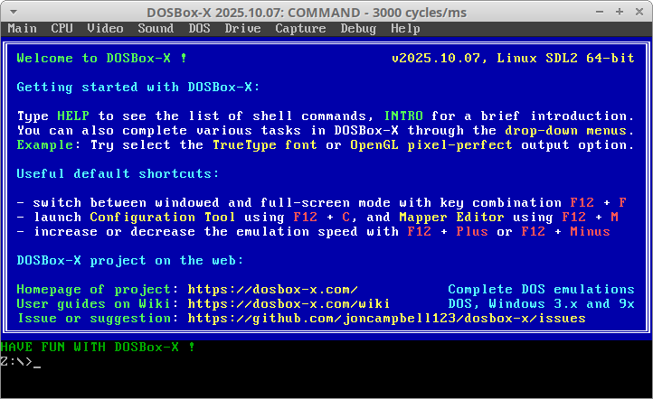
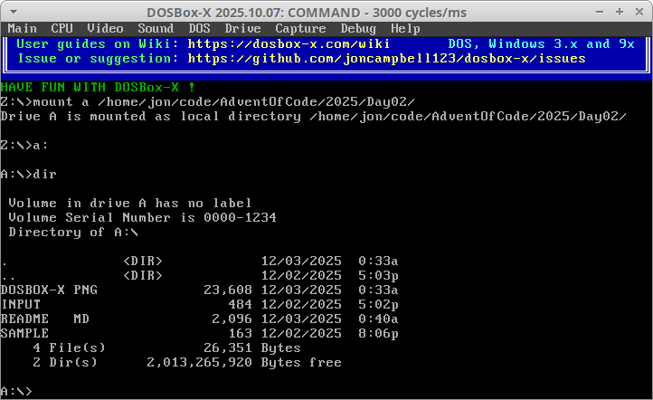
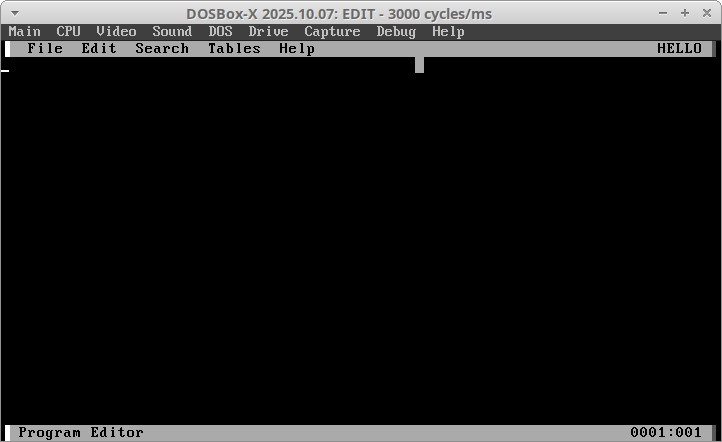
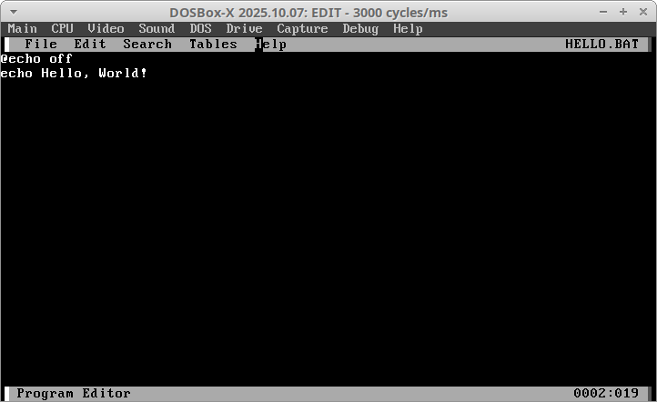
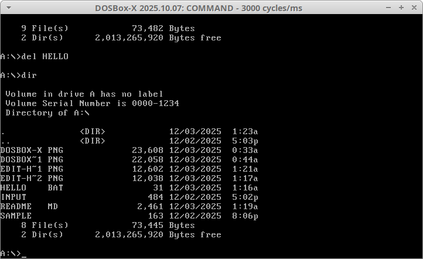
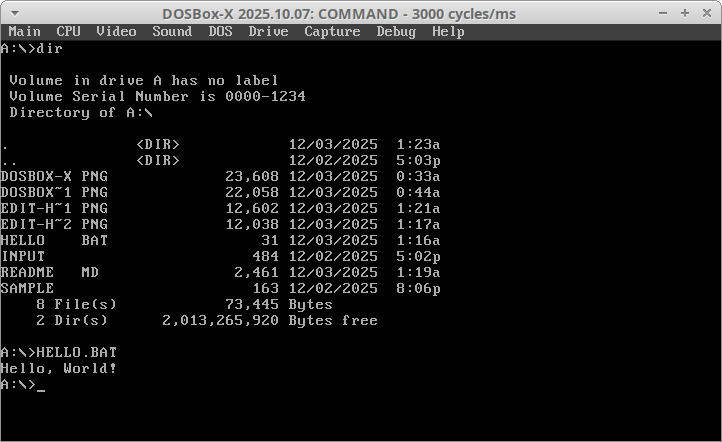

# Day 2

In the 1990s I spent a lot of time on Windows 3.1/MS-DOS, Windows 95, Windows 98, and later Windows ME. Being the clueless teenage "1337 HAX0R" I thought I was at the time, I dabbled in Batch scripting. I never accomplished much back then, but it still counted as programming, so I will attempt to use it for Day 2.

## Choosing your environment

There are a number of ways you could approach this day's challenge in Batch scripting. I will focus on MS-DOS and Win9x variants here, but you could use newer Windows NT (XP/7) versions of DOS/Batch and still be close enough.

1. **Pure**<br />
   The hardcore option is to use real MS-DOS or Windows, even on actual hardware. VMware or VirtualBox would also count as "pure enough."

2. **Free**<br />
   Another option, less pure but more open and non-proprietary, is FreeDOS, which also works on real hardware or in a VM.

3. **Easy**<br />
   Less pure still, but accurate enough, are tools like DOSBox and DOSBox-X. These lean more toward emulation, but offer many conveniences compared to native options. Still close enough for AoC.

4. **Dirty**<br />
   Probably the easiest and laziest option would be running DOS programs under WINE, but it works fine.

Although I do not have easy access to true Windows on my personal machines anymore, I could use an old Windows ISO with VirtualBox. However, I am going to fall back on one of the DOSBox options. I will try DOSBox-X first.

## Prerequisites for Ubuntu 22.04

In Ubuntu 22.04, DOSBox is available in the apt repo, and DOSBox-X is available as a snap.

```
sudo snap install dosbox-x
```

or

```
sudo apt install dosbox
```

I am going with DOSBox-X. Once installed, launch it:

```
dosbox-x
```



## A simple Hello World

Once inside DOSBox-X, mount a directory. I chose to mount /home/jon/code/AdventOfCode/2025/Day02/ as my A: drive.

```
mount a /home/jon/code/AdventOfCode/2025/Day02/
a:
dir
```

You should now see the contents of the mounted directory.



Next, create the `HELLO.BAT` file. Back in the day I used Notepad in Windows, but for the challenge I will use the DOS text editor `edit`. Sadly it's not white-on-blue like the original, but it works pretty much the same.

```
edit HELLO.BAT
```



Type the basic Hello World program below:

```
@echo off
echo Hello World
```



Save with Ctrl-S, then exit with Alt-X, or use the menus.

Check the directory listing for the new program:

```
dir
```



Then run the program:

```
HELLO.BAT
```



## The daily challenge

### 🧱 Immediate Roadblock

In researching Batch I quickly found that the COMMAND.COM in MS-DOS 6 and Win9x for Batch programming is not up to the task of this AoC challenge. This is primarily because several limitations:

- Can't read files line-by-line or in it's entirety into a variable
- Almost no string manipulation
- Limited looping

With COMMAND.COM much of the advanced processing is usually done with other helper programs in other languages with Batch just being used as a simple launcher. At that point I am basically using a different programming language for the challenge so whats the point of trying to use Batch?

### ❓ So what now?

How can I pull this off and be as pure as possible. Some options:

#### 4DOS
DOS-Box can run 4DOS, which is much more capable. It originates from 1989 and was intended as a replacement for COMMAND.COM in MS-DOS, and Windows 9x. However, not a Microsoft product.

#### NT cmd.exe
Step slightly into the future and use cmd.exe from NT-based Windows (NT, 2000, XP, 7, etc). Can be run in DOS-Box-X if I have it run Windows, or I can fall back to a VM install. From Microsoft and native to Windows, but the timeframe and versions don't match what I learned, if I am trying to stay true to my original intent for these challenges.

#### Manually set variables to match the input data
The input file is shorter today, so this MIGHT be possible depending on how capable the string manipulation and looping is in DOS 6 Batch. I'll have to investigate this further before eliminating it as an option.

So which do I use? I will sleep on it and return to this later...